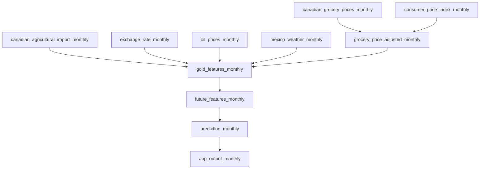
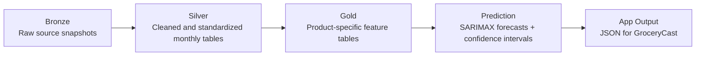

SFU BigData Lab2 Project

# Grocery Price Prediction

This project forecasts monthly Canadian grocery prices for **avocado and tomato** using statistical and machine learning models. It integrates historical retail prices with external indicators such as **import volumes, gas prices, weather (temperature and precipitation), exchange rates, and CPI** to improve prediction accuracy.

The system is designed as an **end-to-end automated pipeline**, where data is updated periodically and predictions are generated automatically.

---

## Project Overview

The project includes:
- data integration from economic and environmental sources  
- feature engineering with lag analysis and transformations  
- model comparison across baseline, time series, and machine learning approaches  
- an automated pipeline for generating predictions  

---

## Final Outputs

- **Web application (GroceryCast):** [http://35.91.193.142:3000](http://35.91.193.142:3000)
- **Interactive dashboard:** [https://jli624.shinyapps.io/grocerypriceprediction/](https://jli624.shinyapps.io/grocerypriceprediction/)

**GroceryCast** is our main web app for grocery price forecasting. It is designed to be simple and easy to use. Users can check predicted prices for upcoming periods, see whether prices are expected to go up or down, and view historical price trends.

We also provide a separate interactive dashboard for deeper analysis. The dashboard includes model comparisons, predicted vs. actual price plots, historical trends, and lag analysis. The web app is meant for quick and simple use, while the dashboard gives more detail for users who want to explore the results further.

---

## Tech Stack

- **Python** : data processing, feature engineering, and forecasting
- **Apache Airflow** : automated monthly pipeline
- **AWS EC2** : hosting Airflow and the web application
- **AWS S3** : Bronze, Silver, Gold, prediction, and app-output storage
- **Next.js + React + TypeScript** : GroceryCast web app
- **Docker** : application packaging and deployment
- **Shiny** : interactive dashboard

---

## Automated Pipeline (Airflow)

This project uses **Apache Airflow** to automate the full workflow:

- monthly data ingestion  
- data cleaning and preprocessing  
- feature engineering  
- forecasting  
- app output generation  

This lets us update the data and generate new forecasts automatically each month.

At a high level, the pipeline checks public data sources for new grocery price, CPI, import, exchange-rate, oil-price, and weather data. It then cleans the data, builds product-specific features, runs the forecasting model, and prepares the final JSON files used by the GroceryCast web app.

### Airflow DAG Flow



The DAG structure is split into small parts. Source-specific DAGs collect and clean monthly data for grocery prices, CPI, imports, exchange rates, oil prices, and weather. These outputs are then used to create adjusted price tables and Gold feature tables. After that, the pipeline builds future features, runs the SARIMAX forecast, and prepares the final app output.

### Data Layers



The pipeline follows a **Bronze-Silver-Gold** architecture. The Bronze layer stores raw data from external sources. The Silver layer stores cleaned and standardized monthly tables. The Gold layer stores product-specific feature tables for forecasting. These Gold tables are used to generate predictions and confidence intervals, and the final outputs are saved as JSON files for the GroceryCast frontend.

---

## Modeling Approach

We evaluate three types of models:
- **Baseline**: naive  
- **Time series**: SARIMA, SARIMAX  
- **Machine learning**: XGBoost  

Evaluation metrics:
- MAE  
- RMSE  
- MAPE  
- Directional Accuracy  

We use **expanding-window cross-validation with one-step-ahead forecasting** to simulate real-world prediction.

---

## How to Run the Project

### 1. Baseline (Naive) and SARIMA

```bash
python model/run_baseline_sarima.py
```

Output:
- Generates baseline (naive) and SARIMA results

Results Location:
- `prediction-result/{product}/`
  - Prediction datasets
  - Accuracy metrics


### 2. XGBoost

```bash
python model/xgboost.py
```

Output:
- Generates XGBoost results

Results Location:
- `prediction-result/{product}/`
  - Prediction datasets
  - Accuracy metrics


### 3. SARIMAX (Final Model)

SARIMAX is the final selected model.

Its outputs are stored separately in:
- `sarimax-model-output/`
  - Final predictions
  - Evaluation results

---
## Team Members
- Joohyun Park
- Jiayi Li
- Hongrui Qu
- Tracy Cui

---
    
