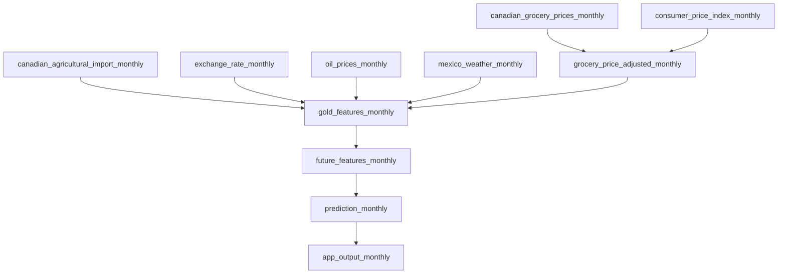
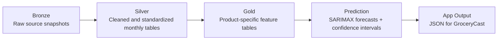

SFU BigData Lab2 Project

## requirement  

In your repository, please include a file README.txt (or README.md if you prefer) indicating how we can actually test your project as well as other notes about things we should look for. If you created some kind of web frontend, please include a URL in the README.md as well.

**Internal Document:**   
https://docs.google.com/document/d/1qe57lMZQkCWW0wimnmd1cKWC8teOTCj8oKzUkfZY7gU/edit?tab=t.0

---

# Grocery Price Prediction

This project forecasts monthly Canadian grocery prices for **avocado and tomato**. It combines historical retail prices with external indicators such as **import volumes, gas prices, weather (temperature and precipitation), exchange rates, and CPI** to improve prediction accuracy.

The system is designed as an **end-to-end automated pipeline**, where data is updated monthly and predictions are generated automatically.

## Tech Stack

- **Python** : data processing, feature engineering, and forecasting
- **Apache Airflow** : automated monthly pipeline
- **AWS EC2** : hosting Airflow and the web application
- **AWS S3** : Bronze, Silver, Gold, prediction, and app-output storage
- **Next.js + React + TypeScript** : GroceryCast web app
- **Docker** : application packaging and deployment
- **Shiny** : interactive dashboard

---

## Final Outputs

- **Web application (GroceryCast):** [http://35.91.193.142:3000](http://35.91.193.142:3000)
- **Interactive dashboard:** [https://jli624.shinyapps.io/grocerypriceprediction/](https://jli624.shinyapps.io/grocerypriceprediction/)

**GroceryCast** is our main web app for grocery price forecasting. It is designed to be simple and easy to use. Users can check predicted prices for upcoming periods, see whether prices are expected to go up or down, and view historical price trends.

We also provide a separate interactive dashboard for deeper analysis. The dashboard includes model comparisons, predicted vs. actual price plots, historical trends, and lag analysis. The web app is meant for quick and simple use, while the dashboard gives more detail for users who want to explore the results further.

---

## Project Goal

The goal of this project is to:

- predict next-month grocery prices for avocado and tomato in Canada  
- compare baseline, time series, and machine learning approaches  
- incorporate external supply chain and economic signals  
- build an automated forecasting pipeline  
- develop an application and dashboard for visualization  

---

## Data Sources

This project integrates multiple monthly datasets:

- **Canadian retail grocery prices** (target variable) - Statistics Canada
- **Agricultural import data** - Statistics Canada’s Canadian International Merchandise Trade data
- **Gas price signals** (U.S., Canada → weighted fuel cost proxy) - U.S. Energy Information Administration, Statistics Canada
- **Exchange rates** (CAD/USD, CAD/MXN) - Bank of Canada
- **Weather data (temperature and precipitation from Mexican production regions)** - Meteorological Service of Mexico
- **Canadian CPI** (inflation adjustment) - Statistics Canada
- **FAO food price index** (supplementary signal) - Food and Agriculture Organization (FAO)

---

## Automated Pipeline (Airflow)

This project uses **Apache Airflow** to automate the full workflow:

- monthly data ingestion  
- data cleaning and preprocessing  
- feature engineering  
- forecasting  
- app output generation  

This lets us update the data and generate new forecasts automatically each month.

At a high level, the pipeline checks public data sources for new grocery price, CPI, import, exchange-rate, oil-price, and weather data. It then cleans the data, builds product-specific features, runs the forecasting model, and prepares the final JSON files used by the GroceryCast web app.

### Airflow DAG Flow

The DAG structure is split into small parts. Source-specific DAGs collect and clean monthly data for grocery prices, CPI, imports, exchange rates, oil prices, and weather. These outputs are then used to create adjusted price tables and Gold feature tables. After that, the pipeline builds future features, runs the SARIMAX forecast, and prepares the final app output.

### Data Layers

The pipeline follows a **Bronze-Silver-Gold** architecture. The Bronze layer stores raw data from external sources. The Silver layer stores cleaned and standardized monthly tables. The Gold layer stores product-specific feature tables for forecasting. These Gold tables are used to generate predictions and confidence intervals, and the final outputs are saved as JSON files for the GroceryCast frontend.

---

## Feature Engineering

Key feature engineering steps include:

- **Lag features**: target and external variables with 1–12 month lags  
- **CPI adjustment**: normalize prices to real values (base year)  
- **Fuel cost proxy**: weighted combination of U.S., Canada, and Mexico gas prices  
- **Weather features**: temperature and precipitation from production regions  
- **Log transformation**: applied to stabilize variance for certain models  

These features are designed to capture **seasonality, supply chain delays, and macroeconomic effects**.

---

## Modeling Approach

We evaluate multiple forecasting approaches:

### Baselines
- Naive  
- Seasonal Naive  

### Time Series Models
- SARIMA  
- SARIMAX (with external indicators)  

### Machine Learning
- XGBoost  

To better reflect real-world supply chain dynamics, we incorporate **lagged external features (1–6 months)** to capture delays between production, transportation, and retail pricing.

---

## Evaluation

Models are evaluated using:

- **MAE (Mean Absolute Error)**  
- **RMSE (Root Mean Squared Error)**  
- **MAPE (Mean Absolute Percentage Error)**  

We use **expanding window cross-validation with one-step-ahead forecasting**, which simulates a real-world prediction setting where only past data is available at each step.

---

## Team Members
- Joohyun Park
- Jiayi Li
- Hongrui Qu
- Tracy Cui

---

## Code Structure
- **Feature-Engineering**
  -  **calculate_lag.py: Computes correlations between variables across all lag values up to a maximum lag of 12 months.**
     -  input: Cleaned datasets from the AdjustedData folder:
         -  avocado_price_adjusted.csv, 
         -  tomato_price_adjusted.csv, 
         -  avocado_import.csv,              
         -  tomato_import.csv, 
         -  mexico_weather_adjusted.csv, 
         -  gas_price.csv, 
         -  xrate_adjusted.csv
     -  output: 
         -  avocado_lag_results_manual.csv (selected lag features of avocado)
         -  tomato_lag_results_manual.csv (selected lag featutures of tomato)
         -  avocado_correlations_lag12.csv (full lag correlation results of avocado)
         -  tomato_correlations_lag12.csv (full lag correlation results of tomato)
  -  **feature_lag.py: Generates the final feature sets by applying selected lags and preparing both training and future datasets.**
     -  input: Same datasets as calculate_lag.py, and the following lag datasets:
         -  tomato_lag_results_manual.csv 
         -  avocado_lag_results_manual.csv
     -  output: 
         -  avocado_final_selective_log.csv (lagged avocado features with target variable; last row corresponds to the final observed price)
         -  tomato_final_selective_log.csv (lagged tomato features with target variable; last row corresponds to the final observed price)
         -  avocado_future_features.csv (lagged avocado features for forecasting, covering periods after the last observed price to the prediction horizon)
         -  tomato_future_features.csv (lagged tomato features for forecasting, covering periods after the last observed price to the prediction horizon)
- **model: Training, evaluation, and prediction pipeline**
   -   **sarimax_predict_future.py:Predicts the target price using the SARIMAX model**
        -  input: Outputs generated from feature_lag.py in the Feature-Engineering module
            -  avocado_final_selective_log.csv
            -  tomato_final_selective_log.csv
            -  avocado_future_features.csv
            -  tomato_future_features.csv
        - output: Predicted prices along with confidence intervals, stored in **sarimax-model-output** module
          - avocado_sarima_predictions.csv
          - tomato_sarima_predictions.csv
    -   **sarimax_evaluation.py:Evaluate the SARIMAX model**
        -  input: Same datasets as sarimax_predict_future.py
        - output: Historical predictions versus actual prices (last five years), including confidence intervals, stored in **sarimax-model-output** module.
          - avocado_sarimax_cv_results.csv
          - tomato_sarimax_cv_results.csv
    
