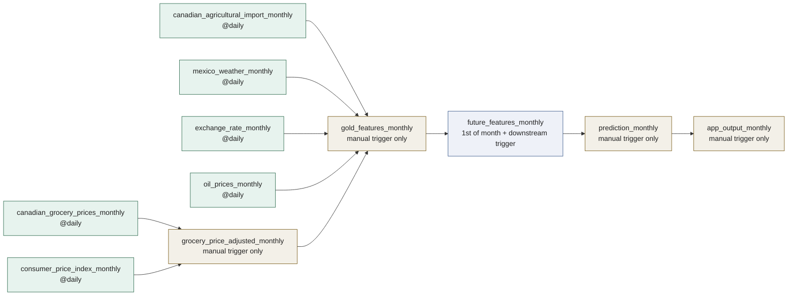
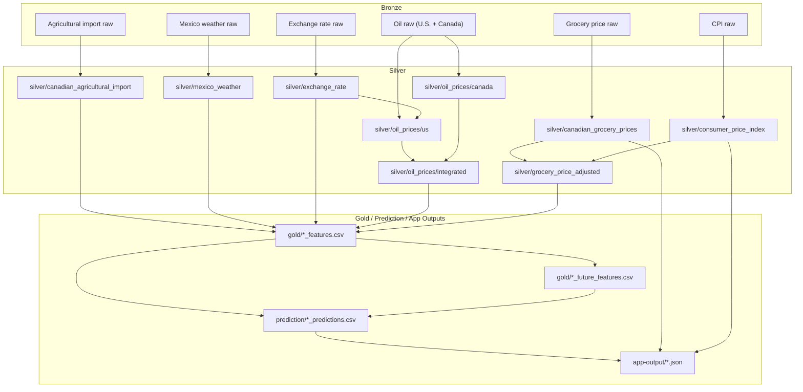
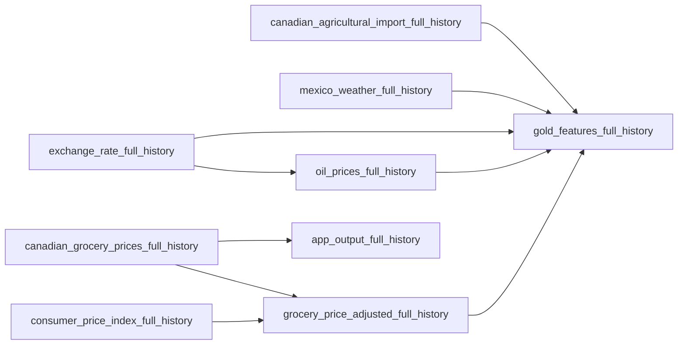

# Airflow DAG Structure

This folder contains the current Airflow DAGs for the data lake and feature
pipeline.

- `full/`: one-time historical backfill DAGs
- `monthly/`: recurring or manually triggered update DAGs for current data

The storage pattern is:

1. `bronze/` for raw ingested source snapshots
2. `silver/` for cleaned and transformed datasets
3. `gold/` for model-ready feature tables
4. `prediction/` for monthly model forecast CSVs
5. `app-output/` for frontend-ready JSON payloads

## Current DAG Inventory

### `full/` DAGs

| File | DAG ID | Schedule | Purpose |
| --- | --- | --- | --- |
| `canadian_agricultural_import_full.py` | `canadian_agricultural_import_full_history` | `None` | Backfill avocado and tomato import Silver datasets |
| `canadian_grocery_prices_full.py` | `canadian_grocery_prices_full_history` | `None` | Backfill Canadian grocery price Silver datasets |
| `consumer_price_index_full.py` | `consumer_price_index_full_history` | `None` | Backfill CPI Silver datasets |
| `exchange_rate_full.py` | `exchange_rate_full_history` | `None` | Backfill FX Silver datasets |
| `grocery_price_adjusted_full.py` | `grocery_price_adjusted_full_history` | `None` | Build CPI-adjusted grocery price Silver datasets |
| `mexico_weather_full.py` | `mexico_weather_full_history` | `None` | Backfill Mexico weather Silver datasets |
| `oil_prices_full.py` | `oil_prices_full_history` | `None` | Backfill U.S./Canada oil Silver datasets and integrated oil price Silver |
| `gold_features_full.py` | `gold_features_full_history` | `None` | Build historical Gold feature tables |
| `app_output_full.py` | `app_output_full_history` | `None` | Build historical app JSON from actual grocery prices |

### `monthly/` DAGs

| File | DAG ID | Schedule | Purpose |
| --- | --- | --- | --- |
| `canadian_agricultural_import_monthly.py` | `canadian_agricultural_import_monthly` | `@daily` | Poll for latest current-year agricultural import snapshot and update Silver |
| `canadian_grocery_prices_monthly.py` | `canadian_grocery_prices_monthly` | `@daily` | Poll for latest current-year grocery price snapshot and update Silver |
| `consumer_price_index_monthly.py` | `consumer_price_index_monthly` | `@daily` | Poll for latest current-year CPI snapshot and update Silver |
| `exchange_rate_monthly.py` | `exchange_rate_monthly` | `@daily` | Poll for latest current-year FX snapshot and update Silver |
| `grocery_price_adjusted_monthly.py` | `grocery_price_adjusted_monthly` | `None` | Rebuild current-year CPI-adjusted grocery price Silver |
| `mexico_weather_monthly.py` | `mexico_weather_monthly` | `@daily` | Poll for latest Mexico weather month and update Silver |
| `oil_prices_monthly.py` | `oil_prices_monthly` | `@daily` | Poll for latest U.S./Canada oil data and rebuild integrated oil Silver |
| `gold_features_monthly.py` | `gold_features_monthly` | `None` | Rebuild Gold feature tables from latest Silver datasets |
| `future_features_monthly.py` | `future_features_monthly` | `0 0 1 * *` | Build future Gold feature tables for prediction workflows |
| `prediction_monthly.py` | `prediction_monthly` | `None` | Train monthly SARIMAX models from Gold CSVs and save prediction CSVs |
| `app_output_monthly.py` | `app_output_monthly` | `None` | Build frontend JSON from actual prices plus prediction CSVs |

## Cross-DAG Trigger Flow

This diagram shows the actual Airflow DAG-to-DAG trigger relationships in the
current files.

## Monthly Data Dependency View

This diagram shows what each monthly DAG produces and what downstream datasets
depend on.

## Full Backfill Dependency View

The backfill DAGs are mostly independent manual runs. They do not use Airflow
cross-DAG triggers, but they do have data dependencies:

## Task Patterns Inside Each DAG

- Most ingestion DAGs follow `fetch Bronze -> transform Silver`.
- `canadian_grocery_prices_*` and `consumer_price_index_*` each fetch avocado
  and tomato in parallel, then merge into one transform step.
- `oil_prices_*` runs U.S. and Canada branches in parallel, then combines them
  into `silver/oil_prices/integrated`.
- `canadian_grocery_prices_monthly` writes Bronze by `year/month` and merges
  into yearly Silver files.
- `canadian_agricultural_import_monthly` keeps only the latest cumulative
  current-year Bronze CSV snapshot and rebuilds yearly Silver from that file.
- `gold_features_monthly` only has `transform_to_gold`, then triggers
  `future_features_monthly`.
- `future_features_monthly` writes `gold/*_future_features.csv`, then triggers
  `prediction_monthly`.
- `prediction_monthly` trains SARIMAX from Gold CSVs and writes
  `prediction/*_predictions.csv`, then triggers `app_output_monthly`.
- `app_output_monthly` and `app_output_full_history` are single-task DAGs that
  write JSON payloads to `app-output/`.
